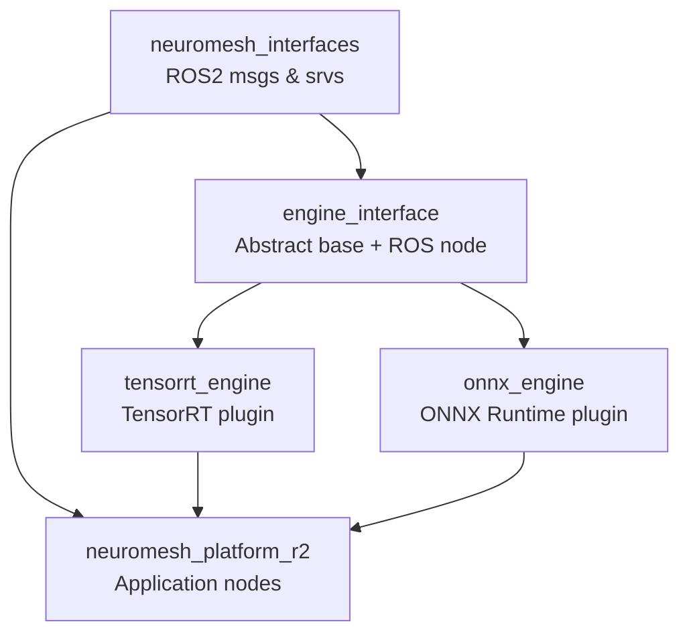
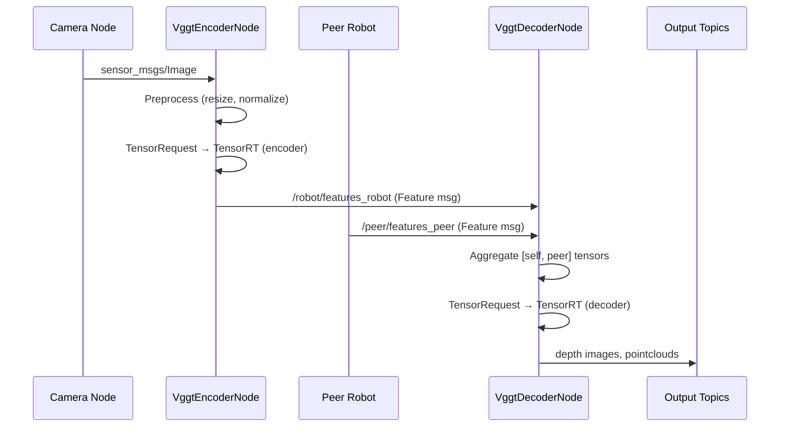
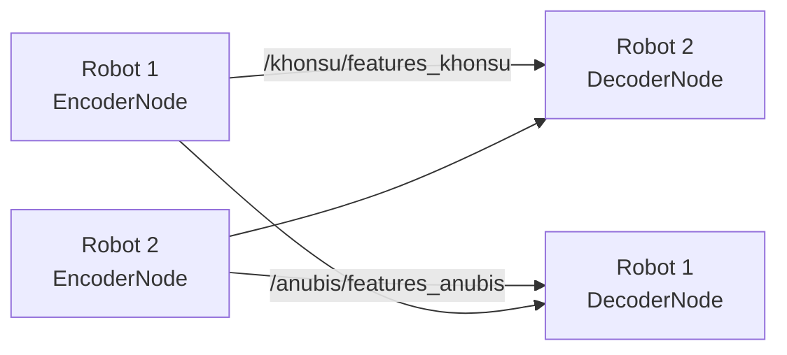

# System Architecture

NeuroMesh is organized as a layered ROS2 C++ system. The core idea is to decouple
neural inference backend from the application (robot behavior) layer via a
plugin-based engine interface.

## Package Overview



## Layer Descriptions

### 1. `neuromesh_interfaces` — ROS2 Message Definitions

Defines the custom ROS2 message and service types used throughout the system:

| Type | Name | Description |
|---|---|---|
| msg | `Tensor` | Raw float tensor with shape |
| msg | `TensorShape` | Shape metadata |
| msg | `Feature` | Encoded neural feature |
| msg | `CompressedFeature` | Compressed feature for bandwidth |
| msg | `CompressedTensor` | Compressed tensor |
| msg | `StateVector` | Robot state vector |
| msg | `CommMessage` | General communication message |
| srv | `TensorRequest` | Request/response for model inference |

### 2. `engine_interface` — Inference Engine Abstraction

Provides the `BaseEngine` abstract class and the `EngineInterfaceNode` ROS2
service server.

**`BaseEngine`** (pure abstract):

```cpp
namespace engine_interface {
class BaseEngine {
public:
    virtual bool loadModel(const std::string& model_path,
                           const std::vector<std::vector<uint32_t>>& input_dims,
                           int type_length) = 0;

    virtual void runInference(const std::vector<const void*>& inputTensors,
                              const std::vector<int>& inputSizes,
                              std::vector<void*>& outputTensors,
                              const std::vector<int>& outputSizes) = 0;
};
}
```

**`EngineInterfaceNode`**: A ROS2 node that exposes inference as a
`TensorRequest` service. It uses `pluginlib` to load the backend engine plugin
at runtime (TensorRT or ONNX).

### 3. `tensorrt_engine` — TensorRT Backend

Implements `BaseEngine` using the NVIDIA TensorRT runtime. Registered as a
`pluginlib` plugin so `EngineInterfaceNode` can load it dynamically.

- Loads `.engine` files (serialized TensorRT engines)
- Manages CUDA device buffers and execution contexts
- Supports FP16 inference

### 4. `onnx_engine` — ONNX Runtime Backend

Implements `BaseEngine` using ONNX Runtime. Useful for development/testing on
machines without TensorRT.

- Loads `.onnx` model files directly
- Runs on CPU or CUDA (depending on available providers)

### 5. `neuromesh_platform_r2` — Application Layer

Contains all application-specific ROS2 nodes:

| Node | Purpose |
|---|---|
| `VggtEncoderNode` | Encodes camera images → feature tensors |
| `VggtDecoderNode` | Aggregates N-robot features → depth, pointcloud |
| `VggtNeuromeshNode` | Monolithic VGGT encoder+decoder |
| `Dust3rNeuromeshNode` | DUSt3R collaborative perception |
| `GatNeuromeshNode` | GAT goal assignment |
| `GatPlannerNeuromeshNode` | GAT-based planning |
| `ControlNeuromeshNode` | Robot motion control integration |
| `CompressionNode` | Feature compression for bandwidth reduction |
| `DecompressionNode` | Feature decompression |
| `VisualizationNode` | Rviz2 visualization helpers |

## Data Flow: VGGT Perception



## Multi-Robot Communication

Robots communicate neural features over ROS2 via Zenoh bridge:



Zenoh bridges ROS2 DDS topics across the network. Each robot configures its
`ROS_DOMAIN_ID` and connects to peers via `config/zenoh_config.json5`.
