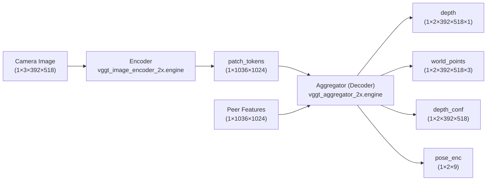

# VGGT Setup

VGGT (Visual Geometry Grounded Transformation) enables multi-robot collaborative
depth estimation and 3D reconstruction from camera images.

## Model Architecture

The VGGT pipeline uses two TensorRT models:



### Encoder: `vggt_image_encoder_2x.engine`

| I/O | Name | Shape |
|---|---|---|
| Input | image | `1 × 3 × 392 × 518` |
| Output | patch_tokens | `1 × 1036 × 1024` |

### Decoder (Aggregator): `vggt_aggregator_2x.engine`

| I/O | Name | Shape | Description |
|---|---|---|---|
| Input | patch_tokens | `2 × 1036 × 1024` | Features from 2 robots |
| Output | pose_enc | `1 × 2 × 9` | Camera pose encoding |
| Output | depth | `1 × 2 × 392 × 518 × 1` | Per-robot depth maps |
| Output | depth_conf | `1 × 2 × 392 × 518` | Depth confidence |
| Output | world_points | `1 × 2 × 392 × 518 × 3` | 3D world points |
| Output | world_points_conf | `1 × 2 × 392 × 518` | Point confidence |

## Image Preprocessing

Before encoding, images are:

1. **Resized** to `392 × 518` (height × width)
2. **Normalized** to `[-1, 1]` range
3. **Transposed** from HWC → CHW format for the neural network

## Configuration

Parameters are set in `config/vggt_config.yaml`:

```yaml
vggt:
  encoder:
    cycle_interval: 3.0          # seconds between encode calls
    image_width: 518
    image_height: 392
    model_path: "..."
  decoder:
    cycle_interval: 3.0          # seconds between decode calls
    feature_age_threshold: 10.0  # max age before falling back to self-features
    num_robots: 2
    model_path: "..."
  robot_names: ["khonsu", "anubis"]
```

## Launch

### Monolithic Node (encoder + decoder in one process)

```bash
ros2 launch neuromesh_platform_r2 vggt_model_neuromesh_launch.py \
    name:=khonsu \
    agent_num:=1 \
    agent_list:="khonsu,anubis" \
    color_raw_topic:=/khonsu/sensors/camera_0/camera/color/image_raw
```

### Separated Encoder + Decoder Nodes

```bash
ros2 launch neuromesh_platform_r2 vggt_separated_launch.py \
    robot_name:=khonsu \
    color_raw_topic:=/khonsu/color_raw
```

### Via Script

```bash
./scripts/vggt_model_neuromesh_launch.sh khonsu 1
```

## Published Topics

Each robot publishes:

| Topic | Type | Description |
|---|---|---|
| `/{robot}/features_{robot}` | `Feature` | Encoded patch tokens (shared with peers) |
| `/{robot}/depth_robot1` | `sensor_msgs/Image` | Depth (self) |
| `/{robot}/depth_robot2` | `sensor_msgs/Image` | Depth (neighbor) |
| `/{robot}/pointcloud_current` | `sensor_msgs/PointCloud2` | 3D points (self) |
| `/{robot}/pointcloud_neighbor` | `sensor_msgs/PointCloud2` | 3D points (neighbor) |
| `/{robot}/pointcloud_current_rgb` | `sensor_msgs/PointCloud2` | RGB pointcloud (self) |
| `/{robot}/pointcloud_neighbor_rgb` | `sensor_msgs/PointCloud2` | RGB pointcloud (neighbor) |

## Default Robot Names

| Robot | `agent_num` |
|---|---|
| khonsu | 1 |
| anubis | 2 |

## Coordinate Frames

| Output | Frame |
|---|---|
| Depth images | `cam1_color_optical_frame` |
| Point clouds | `{robot_name}/map` |
| TF transforms | Broadcast automatically |

## Notes

- Requires exactly **2 robots** for the current `vggt_aggregator_2x.engine` model
- Point cloud confidence threshold: **0.5** (configurable in source)
- If a neighbor's features exceed `feature_age_threshold`, the node falls back
  to using the robot's own features for the missing slot
