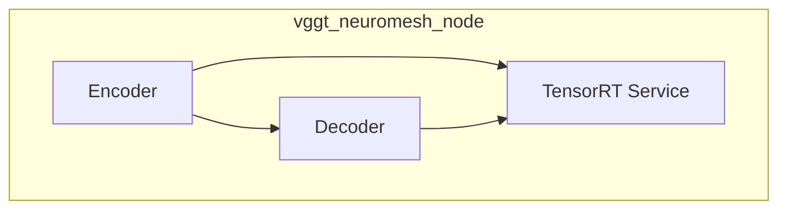
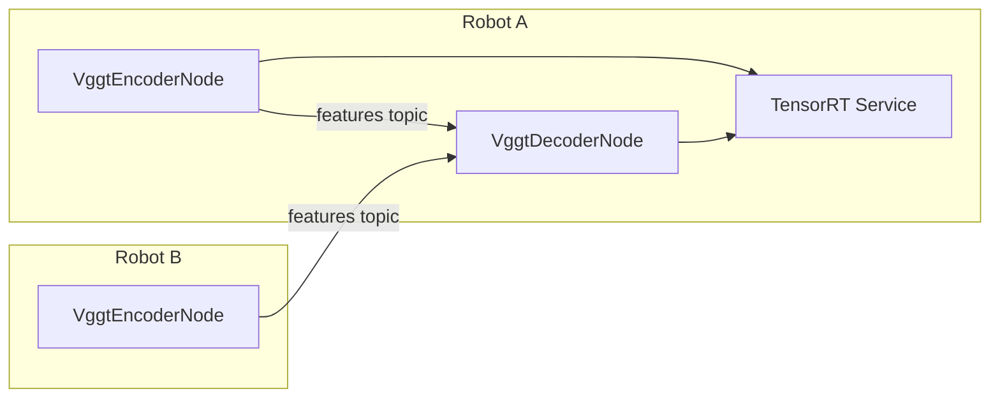
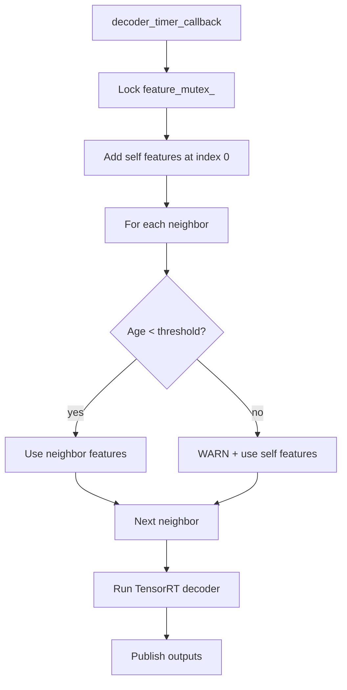

# VGGT Encoder-Decoder Separation Design

## Executive Summary

This document outlines the design for refactoring the VGGT system from a single
monolithic node into two separate ROS2 nodes: `VggtEncoderNode` and
`VggtDecoderNode`. This separation eliminates async scheduling conflicts,
improves modularity, and enables better scalability for multi-robot systems.

## Current vs. Proposed Architecture

**Current (Monolithic)**



**Proposed**



## Node Design

### `VggtEncoderNode`

**Responsibilities**: subscribe to camera images → preprocess → run encoder →
publish feature tensors.

```cpp
class VggtEncoderNode : public rclcpp::Node {
    rclcpp::Subscription<sensor_msgs::msg::Image>::SharedPtr camera_sub_;
    rclcpp::Publisher<neuromesh_interfaces::msg::Feature>::SharedPtr feature_pub_;
    rclcpp::Client<neuromesh_interfaces::srv::TensorRequest>::SharedPtr trt_client_;
    rclcpp::TimerBase::SharedPtr encoder_timer_;

    double encoder_cycle_interval_;
    std::shared_ptr<sensor_msgs::msg::Image> latest_image_;
    std::mutex image_mutex_;
};
```

**Key methods**: `camera_callback()`, `encoder_timer_callback()`,
`process_image()`, `publish_features()`

### `VggtDecoderNode`

**Responsibilities**: subscribe to features from N robots → aggregate tensors →
run decoder → publish depth maps and pointclouds.

```cpp
class VggtDecoderNode : public rclcpp::Node {
    std::map<std::string, rclcpp::Subscription<Feature>::SharedPtr> feature_subs_;
    std::map<std::string, rclcpp::Publisher<sensor_msgs::msg::Image>::SharedPtr> depth_pubs_;
    std::map<std::string, rclcpp::Publisher<sensor_msgs::msg::PointCloud2>::SharedPtr> cloud_pubs_;
    rclcpp::Client<TensorRequest>::SharedPtr trt_client_;
    rclcpp::TimerBase::SharedPtr decoder_timer_;

    double decoder_cycle_interval_;
    double feature_age_threshold_;
    std::map<std::string, Feature> feature_buffer_;
    std::mutex feature_mutex_;
};
```

**Key methods**: `feature_callback()`, `decoder_timer_callback()`,
`aggregate_features()`, `check_feature_freshness()`, `process_decoder_output()`

## Feature Aggregation Strategy

When assembling the `2 × 1036 × 1024` decoder input, the node:

1. Always places **self features** at index 0
2. For each neighbor slot: uses neighbor's features if age < `feature_age_threshold`, otherwise falls back to self features with a warning



## Configuration

Unified YAML (`config/vggt_config.yaml`):

```yaml
vggt:
  encoder:
    cycle_interval: 3.0
    image_width: 518
    image_height: 392
    model_path: "$(find neuromesh_platform_r2)/../../tensorrt_engine/models/vggt/vggt_image_encoder_2x.engine"
  decoder:
    cycle_interval: 3.0
    feature_age_threshold: 10.0
    num_robots: 2
    model_path: "$(find neuromesh_platform_r2)/../../tensorrt_engine/models/vggt/vggt_aggregator_2x.engine"
  robot_names: ["khonsu", "anubis"]
```

## Implementation Roadmap

| Phase | Weeks | Work Items |
|---|---|---|
| 1 — Infrastructure | 1 | New headers, config file structure, test framework |
| 2 — Encoder | 2 | Camera subscription, preprocessing, TRT client, feature publishing |
| 3 — Decoder | 3 | Feature subscriptions, aggregation, TRT client, output processing |
| 4 — Integration | 4 | End-to-end testing, performance benchmarks, docs |
| 5 — Enhancements | TBD | Health monitoring, dynamic reconfigure, feature quality metrics |

## Migration Strategy

- **Backward compatibility**: Maintain existing topic names and message formats
- **Gradual rollout**: Deploy new nodes alongside monolithic node; compare
  outputs; switch once validated; deprecate monolithic node

## Benefits

| Benefit | Description |
|---|---|
| Modularity | Clean separation of encoding and decoding logic |
| Scalability | Extend to N robots without structural changes |
| Maintainability | Smaller, focused classes |
| Flexibility | Independent configuration and deployment |
| Performance | No async scheduling conflicts between encoder and decoder |
| Debugging | Easier to isolate encoder vs. decoder issues |
