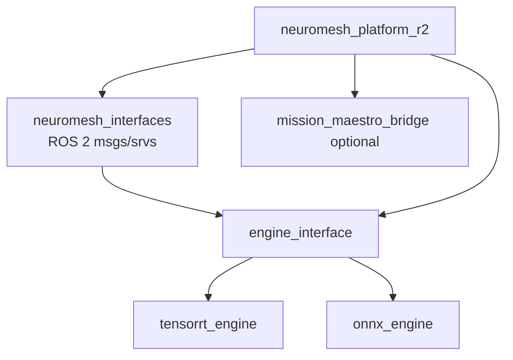

# Architecture

NeuroMesh separates model execution from application logic.

- `engine_interface`: runtime backend abstraction.
- `neuromesh_platform_r2`: application nodes and orchestration.
- `mission_maestro_bridge`: optional integration bridge.
